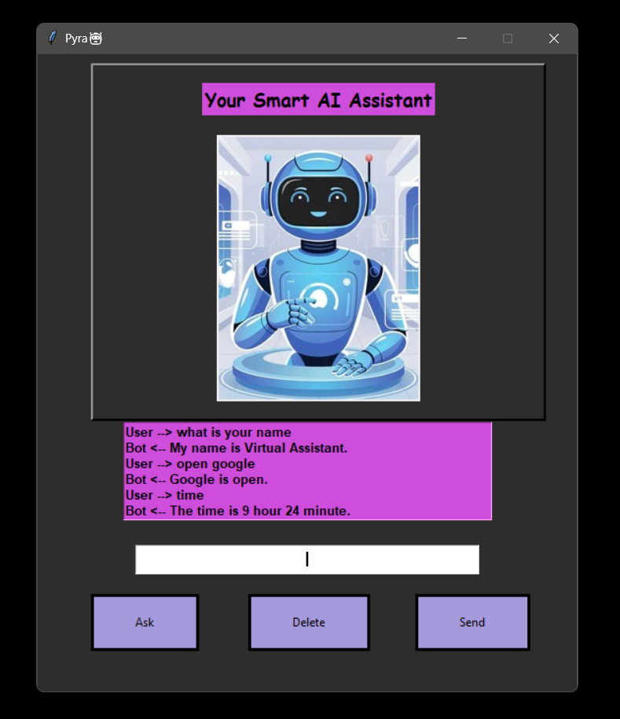
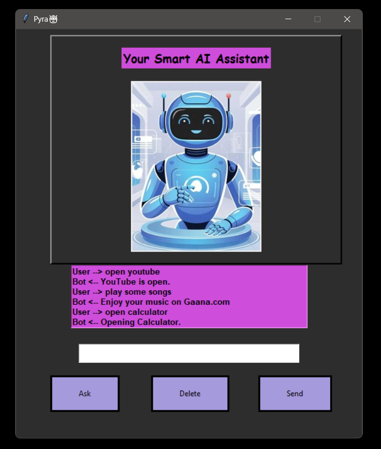

# Pyra – Your Smart AI Assistant 🤖

**Pyra** is a Python-based **Virtual Assistant** that helps you with everyday tasks like opening apps, searching Google/YouTube/Wikipedia, telling jokes, giving inspirational quotes, and more. It uses **speech recognition** and **text-to-speech** to make interactions simple and fun.  

---

## ✨ Features
- 👋 Greets you and introduces itself  
- ⏰ Tells **time** and **date**  
- 🔌 Can **shutdown** or **restart** your system  
- 🌐 Opens **Google** and **YouTube**  
- 🎶 Plays music from **Gaana.com**  
- 📖 Fetches **Wikipedia summaries**  
- 🔍 Performs **Google and YouTube searches**  
- 😂 Tells **jokes** using `pyjokes`  
- 💡 Shares **inspirational quotes**  
- 📝 Opens **Notepad** and **Calculator**  

---

## 🛠️ Tech Stack
- **Python 3**  
- [SpeechRecognition](https://pypi.org/project/SpeechRecognition/) – speech-to-text  
- [pyttsx3](https://pypi.org/project/pyttsx3/) – text-to-speech  
- [wikipedia](https://pypi.org/project/wikipedia/) – fetch summaries  
- [pyjokes](https://pypi.org/project/pyjokes/) – jokes  
- Built-in Python modules: `os`, `datetime`, `webbrowser`, `random`, `urllib`  

---

## 📂 Project Structure
- ├── image/ # Project images (screenshots, assistant image)
- │ ├── assistant.jpg
- │ ├── screenshot1.png
- │ ├── screenshot2.png
- ├── action.py             #Core assistant actions & command handling
- ├── GUI.py                # User interface
- ├── speech_to_text.py     # Speech recognition module
- ├── text_to_speech.py     # Text-to-speech module
- ├── requirements.txt      # Dependencies
- ├── .gitignore            # Ignored files (pycache, env, etc.)

---

## ⚡ Installation & Usage

1. **Clone the repository**  
   ```sh
   git clone https://github.com/your-username/pyra-ai-assistant.git
   cd pyra-ai-assistant

2. **Create virtual environment (recommended)**
    ```sh
    python -m venv venv
    source venv/bin/activate   # On Linux/Mac
    venv\Scripts\activate      # On Windows

3. **Install dependencies**
    ```sh
    pip install -r requirements.txt

4. **Run Pyra**
    ```sh
    python GUI.py

## 🎮 Example Commands

- "Hello" → Hey! How can I help you?
- "What is your name" → My name is Pyra – Your Smart AI Assistant.
- "Time" → The time is 10 hour 45 minute.
- "Date" → Today's date is 2025-08-29.
- "Search for Python programming" → Opens Google search
- "Play music" → Opens Gaana.com
- "Tell me a joke" → Gives a random joke

## 📸 UI & Features Screenshots  

  

  


## 📜 License
- This project is open-source and available under the MIT License


**⚡ Built with ❤️ in Python – Meet Pyra, Your Smart AI Assistant 🤖**

